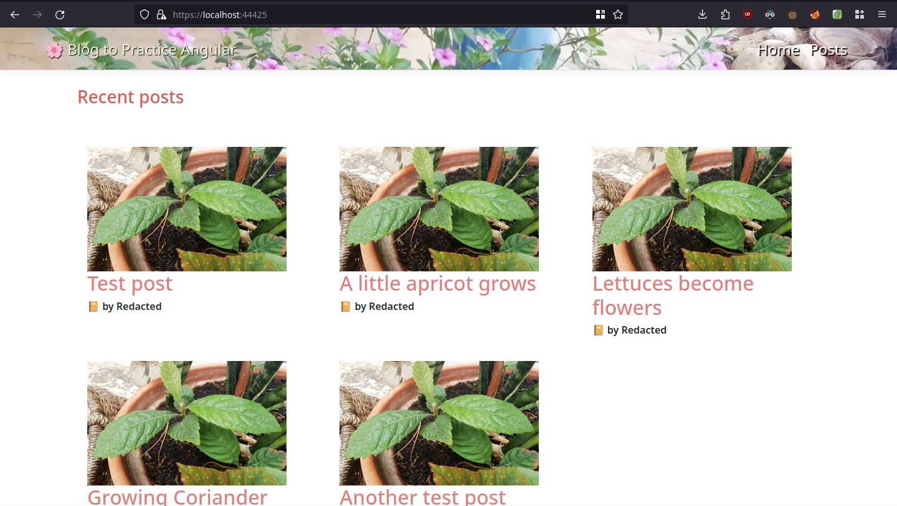

# PracticeAngular
Practice project for a possibly upcoming interview

## Preview 

## Goals
Make a small blog with posts and anonymous comments \
Post comments have to be verified by the poster.

### Objectives:
#### Angular primarily
- [X] (In Progress) Do a simply styled client UI with simple UX
- [ ] Add the anonymous comment UI (a simple input box and button)

#### ASP Side Secondarily:
- [ ] Make the Author and Post data objects
- [ ] Make the comment data objects
- [X] Add OpenAPI automated docs with Swagger (makes testing API easier)

## Building, Testing, Trying the Project
> Install [DotNet](https://dotnet.microsoft.com/) on your machine

>Clone this repository into your machine \
Change into the project directory

>Build the project by executing in the console `dotnet build`

>Change into the ClientApp directory `cd ClientApp`\
and start the angular client app with `npm start`

### Notes about state of the project
Currently focusing on the client angular side since
its where i need to practice more, and later will
start handling the ASP API side
